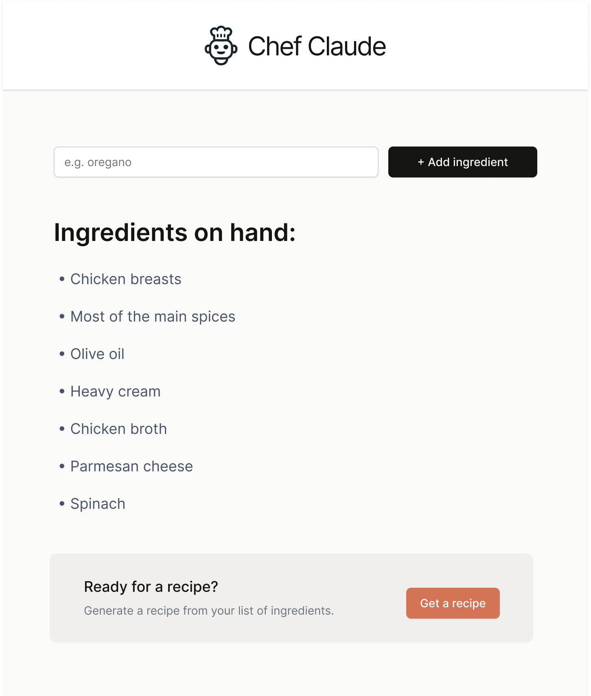

# Chef - Cook With What You Have

Chef is a React app that helps you generate recipes based on the ingredients you already have at home. 

Instead of guessing what to cook, you can add items like chicken breasts, olive oil, or parmesan cheese to your ingredient list, and then let the app suggest a recipe that makes the most of them.

Features:

Add ingredients one by one using the input field and button.

See your current list of ingredients displayed neatly below the form.

Generate a recipe suggestion tailored to your list.

Clean, minimal UI styled with CSS for a modern look.